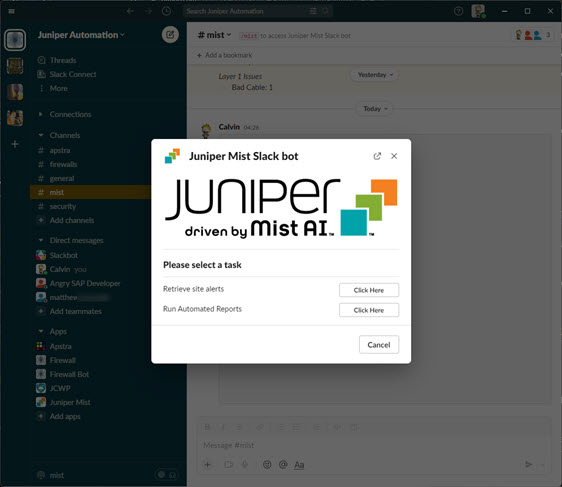
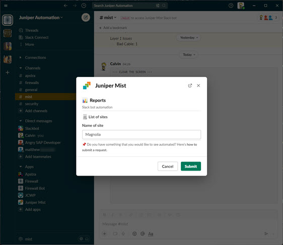
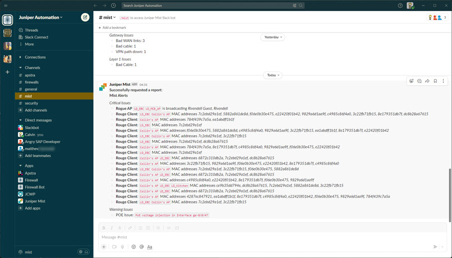
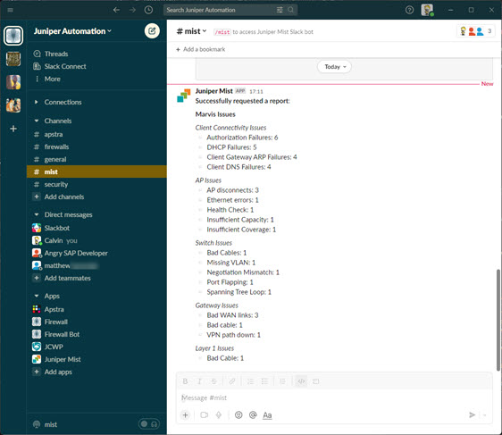
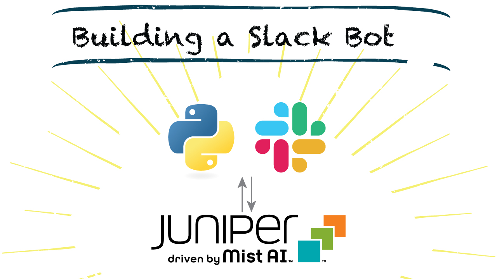

# Slackbot for Juniper Mist

Example Slack bot for interfacing with your Juniper Mist environment

The repository hopes to act as a guide for building bots with Slack Bolt SDK. In our example, we will be building a Python-based Slack bot that will serve as an interface to Juniper Mist.

This project is structured to be more of an educational guide rather than a production-ready piece of software.

---

## Documentation Site

For all information about this project, please reference the [documentation site](https://github.com/cdot65/slackbot-juniper-mist/).

---

## Screenshots

Typing `/mist` in your Slack channel will render a modal.

Selecting an option from our modal will reveal a new view.

Handling the interaction with Mist's REST API, the Slack bot will return the result in an easy-to-read format.

## Video Companion

*TBD, WORK IN PROGRESS*

## Feedback

Have any feedback to share? 🙏 Drop me an [issue](https://github.com/cdot65/slackbot-juniper-mist/issues).

## License

This library is licensed under the Apache 2.0 License.
